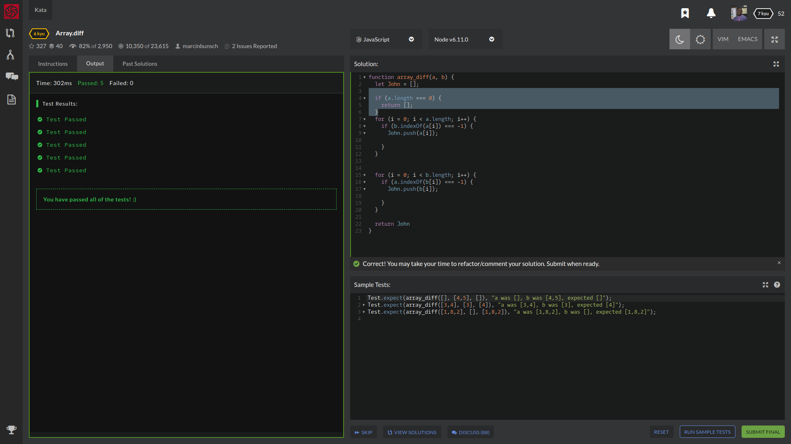

# My Awesome Project
Question:
Your goal in this kata is to implement a difference function, which subtracts one list from another and returns the result.

It should remove all values from list a, which are present in list b.

array_diff([1,2],[1]) == [2]
If a value is present in b, all of its occurrences must be removed from the other:

array_diff([1,2,2,2,3],[2]) == [1,3]

## How It's Made
I knew off rip I had to go thru each indexOf array list[a] and if they were present in [b] remove it. As well as having to remove whatever indexOf[b] that was an occurrence in [a] remove from one another then combine it!

So I wanted to create an array named John, then was thinking I needed to create for(loop)that went thru the length of [a] and check the index of [b] and if it === -1 then it was cool to push it in to my array named John that I made.

The same way I implemented that function, I wanted to do the same for[b] array.  At this point I was stuck because I thought I had the answer but received an error that said "a was [], b was [1,2], expected []". and i had to read this question a dozen times back. I felt like the wording was off but then I figured out what they really wanted me to remove it if that was the same in the other array and return a.length.  once it was pushed.

## Sample Tests:
Test.expect(array_diff([], [4,5], []), "a was [], b was [4,5], expected []");
Test.expect(array_diff([3,4], [3], [4]), "a was [3,4], b was [3], expected [4]");
Test.expect(array_diff([1,8,2], [], [1,8,2]), "a was [1,8,2], b was [], expected [1,8,2]");

## Lessons Learned:
I learned a lot about implementing for loops and checking the indexOf the arrays and removing them and pushing them in another array.

## portfolio:

**WEBSITE:** https:/johnfleurimond.com

## Happy Coding!!!!
